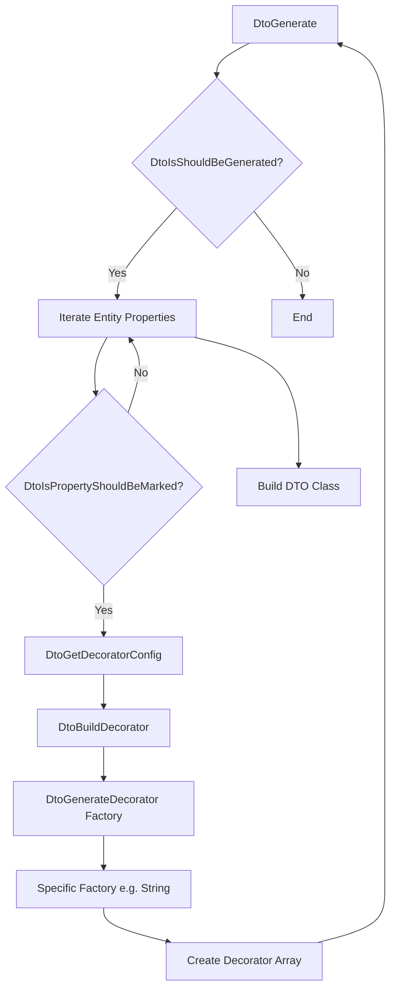

# NestJS CRUD Automator: Полное руководство

Этот документ представляет собой исчерпывающее руководство по библиотеке `@elsikora/nestjs-crud-automator`. Он охватывает все: от основных концепций до тонкостей архитектуры и продвинутых сценариев использования.

## Оглавление

1.  [Введение](#1-введение)
    *   [Какую проблему решает?](#какую-проблему-решает)
    *   [Философия дизайна](#философия-дизайна)
2.  [Ключевые концепции](#2-ключевые-концепции)
    *   [Генерация кода в реальном времени](#генерация-кода-в-реальном-времени)
    *   [Конфигурация через декораторы](#конфигурация-через-декораторы)
    *   [Соглашение вместо конфигурации](#соглашение-вместо-конфигурации)
    *   [Расширяемость и кастомизация](#расширяемость-и-кастомизация)
3.  [Полное руководство по началу работы](#3-полное-руководство-по-началу-работы)
    *   [Шаг 1: Установка](#шаг-1-установка)
    *   [Шаг 2: Определение сущностей](#шаг-2-определение-сущностей)
    *   [Шаг 3: Создание сервисов](#шаг-3-создание-сервисов)
    *   [Шаг 4: Создание контроллера](#шаг-4-создание-контроллера)
    *   [Шаг 5: Настройка модуля](#шаг-5-настройка-модуля)
    *   [Шаг 6: Запуск и тестирование](#шаг-6-запуск-и-тестирование)
4.  [Основные декораторы: Подробный обзор](#4-основные-декораторы-подробный-обзор)
    *   [`@ApiController`](#apicontroller-1)
    *   [`@ApiService`](#apiservice-1)
    *   [`@ApiFunction`](#apifunction-1)
    *   [`@ApiPropertyDescribe`](#apipropertydescribe-1)
5.  [Детальная конфигурация маршрутов](#5-детальная-конфигурация-маршрутов)
    *   [Структура конфигурации маршрута](#структура-конфигурации-маршрута)
    *   [Управление DTO (`dto` и `autoDto`)](#управление-dto-dto-и-autodto)
    *   [Аутентификация (`authentication`)](#аутентификация-authentication)
    *   [Обработка связей (`relations`)](#обработка-связей-relations)
    *   [Трансформация данных (`transformers`)](#трансформация-данных-transformers)
    *   [Пользовательская валидация (`validators`)](#пользовательская-валидация-validators)
6.  [Конфигурация свойств (`@ApiPropertyDescribe`): Полный справочник](#6-конфигурация-свойств-apipropertydescribe-полный-справочник)
    *   [Основные свойства (доступны для всех `type`)](#основные-свойства-доступны-для-всех-type)
    *   [Свойства для `type: EApiPropertyDescribeType.STRING`](#свойства-для-type-eapipropertydescribetype-string)
    *   [Свойства для `type: EApiPropertyDescribeType.NUMBER`](#свойства-для-type-eapipropertydescribetype-number)
    *   [Свойства для `type: EApiPropertyDescribeType.DATE`](#свойства-для-type-eapipropertydescribetype-date)
    *   [Свойства для `type: EApiPropertyDescribeType.ENUM`](#свойства-для-type-eapipropertydescribetype-enum)
    *   [Свойства для `type: EApiPropertyDescribeType.OBJECT`](#свойства-для-type-eapipropertydescribetype-object)
    *   [Переопределение свойств (`properties`)](#переопределение-свойств-properties-1)
7.  [Продвинутые паттерны и техники](#7-продвинутые-паттерны-и-техники)
    *   [Динамические и полиморфные DTO: Подробное руководство](#динамические-и-полиморфные-dto-подробное-руководство)
    *   [RBAC на уровне полей](#rbac-на-уровне-полей)
    *   [CorrelationIDResponseBodyInterceptor: Трассировка запросов](#correlationidresponsebodyinterceptor-трассировка-запросов)
8.  [Архитектурный обзор](#8-архитектурный-обзор)
    *   [Хранилище метаданных (`MetadataStorage`)](#хранилище-метаданных-metadatastorage)
    *   [Конвейер генерации DTO](#конвейер-генерации-dto)
    *   [Система подписчиков](#система-подписчиков)
    *   [Пользовательские валидаторы](#пользовательские-валидаторы)
    *   [@ApiMethod: "Супер-декоратор" для маршрутов](#apimethod-супер-декоратор-для-маршрутов)
9.  [Справочник по API](#9-справочник-по-api)
    *   [Перечисления (`Enums`)](#перечисления-enums)
    *   [Типы (`Types`)](#типы-types)

---

## 1. Введение

### Какую проблему решает?

В типичном NestJS-приложении создание полного набора CRUD-эндпоинтов для сущности включает в себя:
-   Создание контроллера с пятью или более методами (`create`, `getOne`, `getList`, `update`, `delete`).
-   Написание соответствующих методов в сервисе, которые взаимодействуют с базой данных.
-   Определение нескольких DTO (Data Transfer Objects) для валидации входящих данных (`CreateUserDto`, `UpdateUserDto`, `UserListQueryDto`) и сериализации ответов (`UserResponseDto`).
-   Добавление декораторов `@Body()`, `@Query()`, `@Param()` в методы контроллера.
-   Добавление декораторов `@Api...` от `@nestjs/swagger` для документации.

Этот процесс утомителен, подвержен ошибкам и приводит к большому количеству однотипного кода. `nestjs-crud-automator` решает эту проблему, беря на себя всю рутинную работу. Вы описываете *что* вы хотите получить, а не *как* это сделать.

### Философия дизайна

1.  **Декларативность**: Вы описываете желаемое состояние API с помощью декораторов. Логика генерации скрыта от вас.
2.  **Минимум кода**: Цель — сократить объем шаблонного кода до абсолютного минимума.
3.  **Гибкость**: Несмотря на автоматизацию, у вас остается полный контроль. Любую часть сгенерированного поведения можно переопределить или расширить.
4.  **Типобезопасность**: Максимальное использование возможностей TypeScript для предотвращения ошибок на этапе конфигурации.

## 2. Ключевые концепции

### Генерация кода в реальном времени

В отличие от инструментов, генерирующих файлы с кодом (schematics), эта библиотека генерирует классы и применяет декораторы в памяти во время запуска приложения. Когда NestJS инициализирует ваш декорированный контроллер, `nestjs-crud-automator` динамически создает методы, DTO, и привязывает к ним метаданные NestJS и Swagger.

### Конфигурация через декораторы

Вся конфигурация происходит через декораторы TypeScript. Это позволяет держать конфигурацию рядом с кодом, к которому она относится (например, правила валидации поля — рядом с определением поля в сущности).

### Соглашение вместо конфигурации

Библиотека использует разумные соглашения для уменьшения явной конфигурации:
-   **Именование сервисов связей**: Если у сущности `Book` есть связь `author: Author`, библиотека будет ожидать, что сервис для `Author` будет доступен в контроллере под ключом `authorService`.
-   **Префиксы методов**: Генерируемые методы имеют внутренний префикс `__NCD__` (например, `__NCD__create`), чтобы избежать конфликтов с вашими собственными методами в контроллере.
-   **Именование DTO**: Генерируемые DTO получают предсказуемые имена, например `UserCreateBodyDto`, `UserGetListQueryDto`.

### Расширяемость и кастомизация

Вы можете "вмешаться" в любой этап процесса:
-   **Заменить DTO**: Предоставить свой собственный класс DTO вместо сгенерированного.
-   **Дополнить DTO**: Добавить пользовательские валидаторы `class-validator` в сгенерированный DTO.
-   **Добавить валидацию**: Внедрить асинхронную логику валидации, которая выполняется перед основной логикой маршрута.
-   **Трансформировать данные**: Изменить входящие или исходящие данные.
-   **Использовать хуки (подписчики)**: Выполнить код до или после любой операции на уровне контроллера или сервиса.

## 3. Полное руководство по началу работы

Создадим API для блога с пользователями и постами.

### Шаг 1: Установка
```bash
npm install nestjs-crud-automator class-validator class-transformer @nestjs/swagger typeorm @nestjs/typeorm
```

### Шаг 2: Определение сущностей

Опишем сущности `User` и `Post` и их свойства с помощью `@ApiPropertyDescribe`.

`user.entity.ts`
```typescript
import { Entity, PrimaryGeneratedColumn, Column, OneToMany } from 'typeorm';
import { ApiPropertyDescribe, EApiPropertyDescribeType, EApiPropertyStringType } from 'nestjs-crud-automator';
import { Post } from '../post/post.entity';

@Entity()
export class User {
    @PrimaryGeneratedColumn('uuid')
    @ApiPropertyDescribe({ type: EApiPropertyDescribeType.UUID })
    id: string;

    @Column({ unique: true })
    @ApiPropertyDescribe({
        type: EApiPropertyDescribeType.STRING,
        format: EApiPropertyStringType.EMAIL,
        description: 'User email, must be unique.',
        properties: {
            create: { body: { isRequired: true } },
            update: { body: { isRequired: false } },
        }
    })
    email: string;

    @OneToMany(() => Post, post => post.author)
    @ApiPropertyDescribe({ type: EApiPropertyDescribeType.RELATION, description: 'User posts' })
    posts: Post[];
}
```

`post.entity.ts`
```typescript
import { Entity, PrimaryGeneratedColumn, Column, ManyToOne } from 'typeorm';
import { ApiPropertyDescribe, EApiPropertyDescribeType, EApiPropertyStringType } from 'nestjs-crud-automator';
import { User } from '../user/user.entity';

@Entity()
export class Post {
    @PrimaryGeneratedColumn('uuid')
    @ApiPropertyDescribe({ type: EApiPropertyDescribeType.UUID })
    id: string;

    @Column()
    @ApiPropertyDescribe({
        type: EApiPropertyDescribeType.STRING,
        format: EApiPropertyStringType.STRING,
        minLength: 5,
        properties: { create: { body: { isRequired: true } } }
    })
    title: string;

    @ManyToOne(() => User, user => user.posts)
    @ApiPropertyDescribe({ type: EApiPropertyDescribeType.RELATION })
    author: User;
}
```

### Шаг 3: Создание сервисов

Сервисы — это тонкие слои, которые наследуются от `ApiServiceBase` и предоставляют реализацию для `@ApiFunction`.

`user.service.ts`
```typescript
import { Injectable } from '@nestjs/common';
import { ApiService, ApiServiceBase, ApiFunction } from 'nestjs-crud-automator';
import { User } from './user.entity';
import { Repository } from 'typeorm';
import { InjectRepository } from '@nestjs/typeorm';

@Injectable()
@ApiService({ entity: User })
export class UserService extends ApiServiceBase<User> {
    constructor(@InjectRepository(User) public readonly repository: Repository<User>) {
        super();
    }

    @ApiFunction() public get;
    @ApiFunction() public getList;
    @ApiFunction() public create;
    @ApiFunction() public update;
    @ApiFunction() public delete;
}
```

`post.service.ts` (аналогично)
```typescript
// ... imports
@Injectable()
@ApiService({ entity: Post })
export class PostService extends ApiServiceBase<Post> {
    constructor(@InjectRepository(Post) public readonly repository: Repository<Post>) {
        super();
    }
    // ... @ApiFunction() declarations
}
```

### Шаг 4: Создание контроллера

Создадим контроллер для постов. Мы хотим иметь возможность создавать посты, указывая `author` по его `id`.

`post.controller.ts`
```typescript
import { Controller } from '@nestjs/common';
import { ApiController, EApiControllerLoadRelationsStrategy } from 'nestjs-crud-automator';
import { PostService } from './post.service';
import { Post } from './post.entity';
import { UserService } from '../user/user.service';

@Controller('posts')
@ApiController({
    entity: Post,
    routes: {
        create: {
            // Включаем автоматическую обработку связей
            relations: {
                shouldLoadRelations: true,
                // Библиотека будет искать сервисы по соглашению (author -> authorService)
                servicesLoadStrategy: EApiControllerLoadRelationsStrategy.AUTO,
                // Все связи в DTO будут обработаны
                relationsLoadStrategy: EApiControllerLoadRelationsStrategy.AUTO,
            }
        },
        get: {},
        getList: {},
    },
})
export class PostController {
    // Важно: public service и public authorService
    constructor(
        public readonly service: PostService,
        public readonly authorService: UserService, // Сервис для связи 'author'
    ) {}
}
```

### Шаг 5: Настройка модуля

Собираем все вместе в модуле.

```typescript
import { Module } from '@nestjs/common';
import { TypeOrmModule } from '@nestjs/typeorm';
import { ApiSubscriberDiscoveryService } from 'nestjs-crud-automator';
import { User } from './user/user.entity';
import { Post } from './post/post.entity';
import { UserService } from './user/user.service';
import { PostService } from './post/post.service';
import { PostController } from './post/post.controller';
import { UserController } from './user/user.controller'; // Предполагаем, что он тоже создан

@Module({
    imports: [
        // ... TypeOrmModule.forRoot(...)
        TypeOrmModule.forFeature([User, Post])
    ],
    providers: [
        UserService,
        PostService,
        // Сервис для обнаружения подписчиков (если вы их используете)
        ApiSubscriberDiscoveryService,
    ],
    controllers: [PostController, UserController],
})
export class AppModule {}
```

### Шаг 6: Запуск и тестирование

Теперь вы можете запустить приложение. У вас будут рабочие эндпоинты `GET /posts`, `GET /posts/:id` и `POST /posts`.

Пример запроса на создание поста:
`POST /posts`
```json
{
    "title": "My First Post",
    "author": "a1b2c3d4-e5f6-..." // UUID пользователя
}
```
Библиотека автоматически проверит, существует ли пользователь с таким `id`, и если да, привяжет его к новому посту.

## 4. Основные декораторы: Подробный обзор

### `@ApiController`

Превращает обычный класс NestJS в автоматизированный CRUD-контроллер.

| Свойство | Тип                                    | Описание                                                                                                                  |
| :------- | :------------------------------------- | :------------------------------------------------------------------------------------------------------------------------ |
| `entity` | `new () => E`                          | **Обязательно.** Класс-конструктор сущности TypeORM, которой управляет контроллер.                                         |
| `routes` | `Record<EApiRouteType, RouteConfig<E>>` | **Обязательно.** Объект, где ключ - это тип маршрута (`create`, `getList` и т.д.), а значение - его конфигурация. |

### `@ApiService`

Связывает сервис с сущностью и включает его в механизм `nestjs-crud-automator`.

| Свойство | Тип           | Описание                                                       |
| :------- | :------------ | :------------------------------------------------------------- |
| `entity` | `new () => E` | **Обязательно.** Класс-конструктор сущности, с которой работает сервис. |

### `@ApiFunction`

Декоратор-маркер для методов внутри `@ApiService`. Сообщает библиотеке, что она должна предоставить реализацию для этого метода.

```typescript
@ApiFunction()
public getList; // Реализация будет предоставлена
```

### `@ApiPropertyDescribe`

Самый важный и подробный декоратор. Применяется к свойствам сущности и управляет их поведением в DTO, валидации и Swagger-документации. Его конфигурация подробно рассмотрена в [секции 6](#6-конфигурация-свойств-apipropertydescribe-полный-справочник).

## 5. Детальная конфигурация маршрутов

### Структура конфигурации маршрута

Каждый ключ в объекте `routes` декоратора `@ApiController` принимает объект конфигурации.

```typescript
// TApiControllerPropertiesRoute<E, R>
{
    dto?: { /* ... */ },
    autoDto?: { /* ... */ },
    authentication?: { /* ... */ },
    relations?: { /* ... */ },
    transformers?: { /* ... */ },
    validators?: { /* ... */ }
}
```

### Управление DTO (`dto` и `autoDto`)

Вы можете либо предоставить свои собственные DTO, либо настроить их автоматическую генерацию.

-   **`dto`**: Используйте, если у вас есть готовые классы DTO.
    ```typescript
    dto: {
        query: GetPostsQueryDto,    // для GET /posts
        response: PostResponseDto,  // для ответа
    }
    ```
-   **`autoDto`**: Используйте для настройки генерации.
    ```typescript
    autoDto: {
        // Добавить кастомные class-validator'ы в сгенерированный DTO
        body: {
            validators: [{ constraintClass: CustomBodyValidator }]
        }
    }
    ```

### Аутентификация (`authentication`)

Привязывает гвард аутентификации к маршруту.

```typescript
authentication: {
    guard: JwtAuthGuard, // Экземпляр гварда
    // Опционально: тип аутентификации для документации
    type: EApiAuthenticationType.USER,
}
```

### Обработка связей (`relations`)

Включает и настраивает автоматическую загрузку связанных сущностей по их ID.

| Свойство                            | Тип                                   | Описание                                                                                                                |
| :---------------------------------- | :------------------------------------ | :---------------------------------------------------------------------------------------------------------------------- |
| `shouldLoadRelations`               | `boolean`                             | Включает или выключает эту функцию.                                                                                      |
| `relationsLoadStrategy`             | `EApiControllerLoadRelationsStrategy` | `AUTO`: обрабатывать все связи. `MANUAL`: обрабатывать только те, что указаны в `relationsToLoad`.                          |
| `relationsToLoad`                   | `Array<keyof E>`                      | **Обязательно для `MANUAL`**. Список связей для обработки.                                                                  |
| `servicesLoadStrategy`              | `EApiControllerLoadRelationsStrategy` | `AUTO`: искать сервисы по соглашению (`author` -> `authorService`). `MANUAL`: использовать маппинг из `relationsServices`. |
| `relationsServices`                 | `Record<keyof E, string>`             | **Обязательно для `MANUAL`**. Объект, где ключ - имя связи, а значение - ключ сервиса в контроллере.                       |
| `shouldForceAllServicesToBeSpecified`| `boolean`                             | В режиме `AUTO`, если `true`, выдаст ошибку, если сервис для связи не найден. По умолчанию `false`.                           |


### Трансформация данных (`transformers`)

Позволяет изменять объекты `request`, `query`, `body` или `response`.

-   `type`: `STATIC` или `DYNAMIC`.
-   `key`: Имя свойства, которое нужно добавить или изменить.
-   `value`: Значение (для `STATIC`) или константа из `TRANSFORMER_VALUE_DTO_CONSTANT` (для `DYNAMIC`).
-   `shouldSetValueEvenIfMissing`: Если `true`, добавит свойство, даже если его не было в объекте.

Пример: Добавить IP-адрес клиента в тело запроса при создании.
```typescript
transformers: {
    body: [{
        type: EApiControllerRequestTransformerType.DYNAMIC,
        key: 'creatorIp',
        value: TRANSFORMER_VALUE_DTO_CONSTANT.REQUEST_IP,
        shouldSetValueEvenIfMissing: true,
    }]
}
```

### Пользовательская валидация (`validators`)

Добавляет асинхронные функции валидации.

```typescript
validators: [{
    // Функция, возвращающая true или false. Может быть асинхронной.
    validationFunction: async (body, // or query, or params
    ) => {
        // ...
        return true;
    },
    // Исключение, которое будет выброшено при false.
    exception: ConflictException,
    // Ключ для генерации сообщения об ошибке.
    errorType: EErrorStringAction.ALREADY_EXISTS,
}]
```

## 6. Конфигурация свойств (`@ApiPropertyDescribe`): Полный справочник

Декоратор `@ApiPropertyDescribe` является сердцем библиотеки. Он принимает один объект конфигурации, который является [дискриминированным объединением](https://www.typescriptlang.org/docs/handbook/2/narrowing.html#discriminated-unions), где поле `type` определяет доступность остальных полей.

### Основные свойства (доступны для всех `type`)

| Свойство     | Тип                          | Описание                                                                                                                              |
| :----------- | :--------------------------- | :------------------------------------------------------------------------------------------------------------------------------------ |
| `type`       | `EApiPropertyDescribeType`   | **(Дискриминант)**. Обязательное поле. Определяет базовый тип свойства: `STRING`, `NUMBER`, `BOOLEAN`, `DATE`, `ENUM`, `UUID`, `OBJECT`, `RELATION`. |
| `description`| `string`                     | Описание свойства для документации Swagger.                                                                                           |
| `isNullable` | `boolean`                    | По умолчанию `false`. Если `true`, помечает свойство как `nullable` в схеме Swagger.                                                      |
| `isArray`    | `boolean`                    | По умолчанию `false`. Если `true`, указывает, что свойство является массивом (`T[]`). Включает опции `minItems`, `maxItems`, `isUniqueItems`. |
| `minItems`   | `number`                     | (Только если `isArray: true`). Минимальное количество элементов в массиве. Применяет `@ArrayMinSize`.                                    |
| `maxItems`   | `number`                     | (Только если `isArray: true`). Максимальное количество элементов в массиве. Применяет `@ArrayMaxSize`.                                     |
| `isUniqueItems`| `boolean`                  | (Только если `isArray: true`). Указывает, должны ли все элементы массива быть уникальными. Применяет `@ArrayUnique`.                         |
| `example`    | `any`                        | Пример значения для документации Swagger.                                                                                               |
| `properties` | `TApiPropertyDescribePropertiesBaseProperties` | Мощный механизм для переопределения поведения свойства в зависимости от контекста (маршрута и типа DTO). См. [детальное описание](#переопределение-свойств-properties-1). |

### Свойства для `type: EApiPropertyDescribeType.STRING`

| Свойство      | Тип                      | Описание                                                                                                   |
| :------------ | :----------------------- | :--------------------------------------------------------------------------------------------------------- |
| `format`      | `EApiPropertyStringType` | Уточняет формат строки, применяя соответствующий валидатор (`@IsEmail`, `@IsUrl`, и т.д.) и формат в Swagger. |
| `minLength`   | `number`                 | Применяет `@MinLength`.                                                                                    |
| `maxLength`   | `number`                 | Применяет `@MaxLength`.                                                                                    |
| `pattern`     | `string`                 | Регулярное выражение для валидации. Применяет `@Matches`.                                                  |

### Свойства для `type: EApiPropertyDescribeType.NUMBER`

| Свойство      | Тип                        | Описание                                                            |
| :------------ | :------------------------- | :------------------------------------------------------------------ |
| `format`      | `EApiPropertyNumberType`   | `INTEGER` или `DOUBLE`. Влияет на документацию Swagger.            |
| `minimum`     | `number`                   | Применяет `@Min`.                                                   |
| `maximum`     | `number`                   | Применяет `@Max`.                                                   |
| `multipleOf`  | `number`                   | Применяет `@IsDivisibleBy`.                                         |

### Свойства для `type: EApiPropertyDescribeType.DATE`

| Свойство     | Тип                          | Описание                                                                                                                               |
| :----------- | :--------------------------- | :------------------------------------------------------------------------------------------------------------------------------------- |
| `format`     | `EApiPropertyDateType`       | `DATE`, `DATE_TIME`, `TIME`. Влияет на документацию Swagger.                                                                             |
| `identifier` | `EApiPropertyDateIdentifier` | Семантический идентификатор. `CREATED_AT` или `UPDATED_AT` автоматически создают поля `*From` / `*To` для фильтрации по диапазону в `GET_LIST`. |

### Свойства для `type: EApiPropertyDescribeType.ENUM`

| Свойство   | Тип                         | Описание                                                                                |
| :--------- | :-------------------------- | :-------------------------------------------------------------------------------------- |
| `enum`     | `Record<string, any>`       | **Обязательно.** Сам объект перечисления (enum).                                        |
| `enumName` | `string`                    | **Обязательно.** Имя перечисления для генерации схемы Swagger.                          |

### Свойства для `type: EApiPropertyDescribeType.OBJECT`

Это самый сложный тип с несколькими вариантами использования.

| Свойство                 | Тип                               | Описание                                                                                                                                                                                                              |
| :----------------------- | :-------------------------------- | :---------------------------------------------------------------------------------------------------------------------------------------------------------------------------------------------------------------- |
| `dataType`               | `Type` \| `[Type]` \| `Record`    | Определяет тип вложенных данных. Может быть: классом DTO, массивом классов (для `oneOf`), или объектом-конфигурацией для [динамических DTO](#динамические-и-полиморфные-dto-подробное-руководство).               |
| `shouldValidateNested`   | `boolean`                         | По умолчанию `true`. Если `true`, применяет `@ValidateNested()` к свойству.                                                                                                                                         |
| `isDynamicallyGenerated` | `boolean`                         | По умолчанию `false`. Если `true`, `dataType` будет интерпретироваться как объект-конфигурация для динамической генерации DTO, а не как класс.                                                                    |
| `discriminator`          | `object`                          | Конфигурация для полиморфных объектов (`oneOf`).                                                                                                                                                                   |
| `discriminator.propertyName` | `string`                          | Имя свойства в объекте, которое действует как дискриминатор.                                                                                                                                                        |
| `discriminator.mapping`      | `Record<string, string \| Type>` | Объект, сопоставляющий значения дискриминатора с классами DTO или ключами в `dataType` (для динамических DTO).                                                                                                      |

### Переопределение свойств (`properties`)

Объект `properties` позволяет вам изменять поведение поля для конкретного эндпоинта и типа DTO.

**Структура:**
```
properties: {
    [EApiRouteType.CREATE]?: {
        [EApiDtoType.BODY]?: { ...overrides },
        [EApiDtoType.RESPONSE]?: { ...overrides },
    },
    [EApiRouteType.GET_LIST]?: {
        [EApiDtoType.QUERY]?: { ...overrides },
        [EApiDtoType.RESPONSE]?: { ...overrides },
    },
    // и так далее для всех комбинаций...
}
```

**Доступные для переопределения свойства (`overrides`):**

| Свойство           | Тип                                 | Контекст      | Описание                                                                                                    |
| :----------------- | :---------------------------------- | :------------ | :---------------------------------------------------------------------------------------------------------- |
| `isEnabled`        | `boolean`                           | Все           | По умолчанию `true`. Если `false`, свойство будет полностью исключено из данного DTO.                      |
| `isRequired`       | `boolean`                           | `BODY`, `QUERY` | По умолчанию `true`. Если `false`, применяет `@IsOptional()` к свойству в данном DTO.                     |
| `isExpose`         | `boolean`                           | `RESPONSE`    | По умолчанию `true`. Если `false`, применяет `@Exclude()` от `class-transformer`, скрывая поле из ответа. |
| `useAsOrderByFilter` | `boolean`                           | `QUERY`       | По умолчанию `false`. Если `true` для `GET_LIST`, это поле будет включено в `enum` для сортировки `orderBy`. |
| `guard`            | `{ guards: Type<IAuthGuard>[], isInverse?: boolean }` | `RESPONSE`    | Позволяет показывать/скрывать поле в ответе на основе ролей/гвардов. См. [RBAC на уровне полей](#rbac-на-уровне-полей). |

## 7. Продвинутые паттерны и техники

### Динамические и полиморфные DTO: Подробное руководство

Эта возможность является одной из самых мощных в библиотеке. Она позволяет определять структуру DTO, которая меняется в зависимости от значения другого поля. Рассмотрим это на вашем примере с `Challenge`.

**Задача**: Сущность `Challenge` хранится в БД и имеет поле `type` (`CLICK` или `POW`). В зависимости от этого типа, структура полей `data` и `solution` (которые хранятся как `jsonb`) должна быть разной.

#### Шаг 1: Определение "чертежей" для динамических DTO

Вместо создания классов `ChallengeDataClickDto` или `ChallengeDataPowDto`, мы создаем объекты-конфигурации, которые описывают их структуру. Это и есть **"динамические DTO"**.

`challenge-data-pow.dynamic-dto.ts`
```typescript
// Это не класс, а объект-конфигурация (чертеж)
export const ChallengeDataPowDynamicDto: Record<string, TApiPropertyDescribeProperties> = {
	challenge: {
		description: "data PoW challenge",
		type: EApiPropertyDescribeType.STRING,
        // ... все остальные опции, как в обычном @ApiPropertyDescribe
	},
	difficulty: {
		description: "data difficulty",
		type: EApiPropertyDescribeType.NUMBER,
        // ...
	},
	type: { // Важно: дублируем поле-дискриминатор
		description: "data type",
		enum: ECaptchaType,
		enumName: "ECaptchaType",
		type: EApiPropertyDescribeType.ENUM,
	},
};
```
Ключи этого объекта (`challenge`, `difficulty`, `type`) станут свойствами сгенерированного DTO, а значения — их конфигурацией.

#### Шаг 2: Конфигурация `@ApiPropertyDescribe` в сущности

Теперь, в сущности `Challenge`, мы настраиваем поле `data`:

`challenge.entity.ts`
```typescript
@ApiPropertyDescribe({
    // 1. Указываем, что это объект
    type: EApiPropertyDescribeType.OBJECT,

    // 2. Включаем режим динамической генерации
    isDynamicallyGenerated: true,

    // 3. Указываем, что нужно валидировать сгенерированный объект
    shouldValidateNested: true,

    // 4. В dataType передаем маппинг "значение дискриминатора -> чертеж"
    dataType: { 
        [ECaptchaType.CLICK]: ChallengeDataClickDynamicDto, 
        [ECaptchaType.POW]: ChallengeDataPowDynamicDto 
    },

    // 5. Настраиваем дискриминатор
    discriminator: {
        // Указываем, какое поле является дискриминатором
        propertyName: "type",
        // Связываем значения дискриминатора с ключами в dataType
        mapping: {
            [ECaptchaType.CLICK]: ECaptchaType.CLICK,
            [ECaptchaType.POW]: ECaptchaType.POW,
        },
    },
})
@Column({ type: "jsonb" })
data!: IChallengeDataClick | IChallengeDataPow;
```

#### Как это работает "под капотом"

1.  При генерации DTO (например, `ChallengeResponseDto`), утилита `DtoGenerate` доходит до поля `data`.
2.  Она видит `type: 'OBJECT'` и `isDynamicallyGenerated: true`.
3.  Она вызывает `DtoGenerateDynamic`, которая не пытается использовать `dataType` как классы, а итерирует по его ключам (`CLICK`, `POW`).
4.  Для каждого ключа она создает **в памяти новый класс** (например, `ChallengeResponseDataClickDto` и `ChallengeResponseDataPowDto`).
5.  Внутри этих новых классов она создает свойства на основе "чертежей" (`ChallengeDataClickDynamicDto` и `ChallengeDataPowDynamicDto`).
6.  Эти сгенерированные классы регистрируются в Swagger.
7.  В родительском DTO (`ChallengeResponseDto`) поле `data` получает корректную схему `oneOf` со ссылками на сгенерированные схемы.

Этот механизм позволяет описывать сложнейшие полиморфные структуры данных декларативно, прямо в сущности, без необходимости писать десятки классов DTO вручную.

### RBAC на уровне полей

С помощью опции `guard` внутри `properties` можно настроить видимость полей в ответе в зависимости от роли пользователя.

```typescript
@ApiPropertyDescribe({
    type: EApiPropertyDescribeType.STRING,
    description: "Internal secret field",
    properties: {
        [EApiRouteType.GET]: {
            [EApiDtoType.RESPONSE]: {
                // Поле будет присутствовать в ответе ТОЛЬКО если
                // запрос прошел через AdminJwtAuthGuard
                guard: {
                    guards: [AdminJwtAuthGuard] 
                }
            }
        }
    }
})
secret: string;
```

Если установить `isInverse: true`, логика изменится: поле будет видно всем, **кроме** тех, кто прошел через указанный гвард.

### `CorrelationIDResponseBodyInterceptor`: Трассировка запросов

Для упрощения отладки и трассировки запросов в сложных системах библиотека предоставляет `CorrelationIDResponseBodyInterceptor`. Этот перехватчик следует зарегистрировать глобально в вашем `main.ts`.

**Что он делает:**
1.  Перехватывает все исключения в приложении (`HttpException` и другие).
2.  Ищет в заголовках входящего запроса заголовок `x-correlation-id`.
3.  Если заголовок найден, его значение добавляется в тело ответа об ошибке.
4.  Если заголовок не найден, генерируется новый `UUID`, который добавляется и в ответ, и в логи (если используется `LoggerUtility`).
5.  Добавляет в тело ошибки поле `timestamp`.

Это позволяет связать конкретный запрос клиента с логами на сервере, что неоценимо при разборе инцидентов.

**Регистрация:**
`main.ts`
```typescript
async function bootstrap() {
    const app = await NestFactory.create(AppModule);
    // ...
    app.useGlobalInterceptors(new CorrelationIDResponseBodyInterceptor());
    // ...
    await app.listen(3000);
}
```

## 8. Архитектурный обзор

### Хранилище метаданных (`MetadataStorage`)

Это глобальный синглтон, который служит центральным реестром для всей информации, собранной из декораторов `@ApiPropertyDescribe`. Это позволяет отделить фазу сбора информации (когда NestJS сканирует классы) от фазы ее использования (когда генерируются DTO и контроллеры).

### Конвейер генерации DTO


### Система подписчиков (Hooks): Перехват и расширение логики

Это самая мощная функция для расширения стандартного поведения. Она позволяет вам "подписаться" на события жизненного цикла CRUD-запроса и выполнить свой код до, после или в случае ошибки основной операции. Это идеальное решение для таких задач, как:
-   Ведение журнала аудита (auditing).
-   Отправка уведомлений (notifications).
-   Сложная, зависящая от контекста валидация.
-   Обогащение данных (data enrichment) перед сохранением.
-   Кастомная обработка ошибок.

#### Шаг 0: Включение системы подписчиков

Чтобы система подписчиков заработала, необходимо выполнить **три обязательных шага**:

1.  **Импортировать `ApiSubscriberModule`**: Этот модуль предоставляет сервис `ApiSubscriberDiscoveryService`, который отвечает за поиск ваших подписчиков. Его нужно импортировать в корневой модуль вашего приложения.
    `app.module.ts`
    ```typescript
    import { ApiSubscriberModule } from '@elsikora/nestjs-crud-automator';
    
    @Module({
        imports: [
            // ... другие модули
            ApiSubscriberModule, // <--- ВАЖНО
        ],
        // ...
    })
    export class AppModule {}
    ```

2.  **Сделать контроллер "наблюдаемым"**: Добавьте декоратор `@ApiControllerObservable()` к классу контроллера, за событиями которого вы хотите следить.
    ```typescript
    import { ApiController, ApiControllerObservable } from '@elsikora/nestjs-crud-automator';

    @Controller('posts')
    @ApiController({ /* ... */ })
    @ApiControllerObservable() // <--- ВАЖНО
    export class PostController { /* ... */ }
    ```

3.  **Сделать сервис "наблюдаемым"**: Аналогично добавьте декоратор `@ApiServiceObservable()` к классу сервиса.
    ```typescript
    import { ApiService, ApiServiceBase, ApiServiceObservable } from '@elsikora/nestjs-crud-automator';
    
    @Injectable()
    @ApiService({ /* ... */ })
    @ApiServiceObservable() // <--- ВАЖНО
    export class PostService extends ApiServiceBase<Post> { /* ... */ }
    ```

Без этих шагов ваши классы-подписчики просто не будут обнаружены и вызваны.

#### Два уровня перехвата

Существует два типа подписчиков, которые работают на разных уровнях абстракции:

1.  **`ApiRouteSubscriberBase`** (уровень контроллера): Перехватывает данные на самом высоком уровне. Идеально подходит для работы с HTTP-контекстом: заголовками, IP-адресом, аутентифицированным пользователем (`request.user`). Хуки этого подписчика вызываются до и после основной логики *контроллера*.
2.  **`ApiFunctionSubscriberBase`** (уровень сервиса): Перехватывает данные непосредственно перед и после вызова метода репозитория (базы данных). Идеально для манипуляций с данными, которые должны быть сохранены, или с данными, которые только что были получены из БД.

#### Жизненный цикл и порядок выполнения

Понимание порядка вызова хуков критически важно:

1.  **Входящий запрос**
2.  `onBefore...` хуки **Route**-подписчиков (выполняются в порядке `priority` от большего к меньшему).
3.  Внутренняя логика контроллера (трансформеры `request`, `query`, `body`; валидаторы).
4.  Вызывается метод сервиса (например, `service.create(body)`).
5.  `onBefore...` хуки **Function**-подписчиков (выполняются в порядке `priority`).
6.  Выполняется основная логика `@ApiFunction` (например, `repository.save(body)`).
7.  `onAfter...` хуки **Function**-подписчиков (выполняются в **обратном** порядке `priority`).
8.  Результат возвращается в контроллер.
9.  `onAfter...` хуки **Route**-подписчиков (выполняются в **обратном** порядке `priority`).
10. **Ответ отправляется клиенту.**

В случае ошибки на любом из этапов, выполнение прерывается и вызываются соответствующие `on...Error...` хуки.

#### Пример 1: Аудит с помощью `ApiRouteSubscriberBase`

**Задача**: Записывать в лог, какой пользователь создал какой пост.

1.  **Создаем подписчик:**
    `post-audit.subscriber.ts`
    ```typescript
    import { Injectable } from '@nestjs/common';
    import { 
        ApiRouteSubscriber, 
        ApiRouteSubscriberBase, 
        IApiSubscriberRouteExecutionContext
    } from '@elsikora/nestjs-crud-automator';
    import { Post } from './post.entity';
    import { User } from '../user/user.entity'; // Предполагается, что User есть в request.user

    @Injectable()
    @ApiRouteSubscriber({ entity: Post, priority: 10 }) // Указываем сущность и приоритет
    export class PostAuditSubscriber extends ApiRouteSubscriberBase<Post> {
        // Хук вызывается ПОСЛЕ успешного создания поста в контроллере
        async onAfterCreate(
            context: IApiSubscriberRouteExecutionContext<Post, Post, { user: User }>
        ): Promise<Post> {
            const createdPost = context.result; // Результат работы контроллера
            const currentUser = context.data.user; // Неизменяемые входные данные, включая request.user

            if (createdPost && currentUser) {
                console.log(
                    `AUDIT: User ${currentUser.id} created Post ${createdPost.id} with title "${createdPost.title}"`
                );
            }
            
            // Мы не хотим менять результат, поэтому просто возвращаем его
            return createdPost;
        }
    }
    ```

2.  **Регистрируем подписчик:** Добавляем `PostAuditSubscriber` в `providers` вашего модуля.

#### Пример 2: Обогащение данных с помощью `ApiFunctionSubscriberBase`

**Задача**: При создании поста автоматически генерировать `slug` из `title` перед сохранением в БД.

1.  **Создаем подписчик:**
    `post-slug.subscriber.ts`
    ```typescript
    import { Injectable } from '@nestjs/common';
    import { 
        ApiFunctionSubscriber, 
        ApiFunctionSubscriberBase, 
        IApiSubscriberFunctionExecutionContext,
        TApiFunctionCreateProperties 
    } from '@elsikora/nestjs-crud-automator';
    import { Post } from './post.entity';
    import slugify from 'slugify'; // сторонняя библиотека

    @Injectable()
    @ApiFunctionSubscriber({ entity: Post })
    export class PostSlugSubscriber extends ApiFunctionSubscriberBase<Post> {
        // Хук вызывается ПЕРЕД вызовом repository.save()
        async onBeforeCreate(
            context: IApiSubscriberFunctionExecutionContext<Post, TApiFunctionCreateProperties<Post>>
        ): Promise<TApiFunctionCreateProperties<Post>> {
            
            const postData = context.result; // Это объект, который пойдет в repository.save()

            if (postData.body.title) {
                // Модифицируем объект, добавляя slug
                postData.body.slug = slugify(postData.body.title, { lower: true, strict: true });
                console.log(`ENRICHMENT: Generated slug: ${postData.body.slug}`);
            }
            
            // Возвращаем измененный объект, который и будет сохранен
            return postData;
        }
    }
    ```
    
    2.  **Регистрируем подписчик:** Добавляем `PostSlugSubscriber` в `providers` модуля.
    ```typescript
    // ...
    providers: [
        UserService,
        PostService,
        PostSlugSubscriber, // <-- Регистрируем наш подписчик как провайдер
    ],
    // ...
    ```
    *Примечание: для этого примера в сущность `Post` нужно добавить поле `slug`.*

## 9. Справочник по API

### Перечисления (`Enums`)

#### Основные перечисления

-   **`EApiRouteType`**: Определяет типы CRUD-маршрутов, которые можно сгенерировать.
    -   `CREATE`, `DELETE`, `GET`, `GET_LIST`, `PARTIAL_UPDATE`, `UPDATE`
-   **`EApiDtoType`**: Указывает контекст DTO.
    -   `BODY`, `QUERY`, `REQUEST` (параметры пути), `RESPONSE`
-   **`EApiPropertyDescribeType`**: Основной дискриминант для `@ApiPropertyDescribe`.
    -   `BOOLEAN`, `DATE`, `ENUM`, `NUMBER`, `OBJECT`, `RELATION`, `STRING`, `UUID`
-   **`EApiAction`**: Семантическое действие, выполняемое маршрутом. Используется для генерации документации.
    -   `CREATE`, `DELETE`, `FETCH`, `FETCH_LIST`, и т.д.

#### Фильтрация и сортировка

-   **`EFilterOperation`**: Полный список операторов для фильтрации в `GET_LIST`.
    -   `EQ` (равно), `NE` (не равно), `GT` (больше), `LT` (меньше), `GTE` (больше или равно), `LTE` (меньше или равно), `STARTS` (начинается с), `ENDS` (заканчивается на), `CONT` (содержит), `EXCL` (не содержит), `IN` (входит в массив), `NOTIN` (не входит в массив), `ISNULL` (является null), `NOTNULL` (не является null), `BETWEEN` (между двумя значениями).
    -   Варианты с `L` в конце (`EQL`, `NEL`, `CONTL` и т.д.) означают регистронезависимые операции.
-   **`EFilterOperationString`**, **`EFilterOperationNumber`**, и т.д.: Подмножества `EFilterOperation`, специфичные для каждого типа данных.
-   **`EFilterOrderDirection`**: Направление сортировки.
    -   `ASC` (по возрастанию), `DESC` (по убыванию).

#### Конфигурация свойств

-   **`EApiPropertyStringType`**: Форматы для строковых свойств.
    -   `STRING`, `EMAIL`, `URL`, `UUID`, `DATE`, `LOWERCASE_STRING`, `UPPERCASE_STRING`, `REGEXP`.
-   **`EApiPropertyNumberType`**: Форматы для числовых свойств.
    -   `INTEGER`, `DOUBLE`.
-   **`EApiPropertyDateType`**: Форматы для свойств даты.
    -   `DATE`, `DATE_TIME`, `TIME`.
-   **`EApiPropertyDateIdentifier`**: Семантические идентификаторы для дат.
    -   `CREATED_AT`, `UPDATED_AT` (генерируют `From`/`To` поля для фильтрации), `DATE`, `EXPIRES_IN`, `REFRESH_IN`.

#### Система подписчиков

-   **`EApiSubscriberOnType`**: Определяет момент вызова хука подписчика.
    -   `BEFORE`, `AFTER`, `BEFORE_ERROR`, `AFTER_ERROR`.
-   **`EApiFunctionType`**: Типы методов на уровне сервиса.
    -   `CREATE`, `DELETE`, `GET`, `GET_LIST`, `GET_MANY`, `UPDATE`.

#### Другие

-   **`EApiControllerLoadRelationsStrategy`**: Стратегия загрузки связей.
    -   `AUTO`, `MANUAL`.
-   **`EApiControllerRequestTransformerType`**: Тип трансформера данных.
    -   `STATIC`, `DYNAMIC`.

### Типы (`