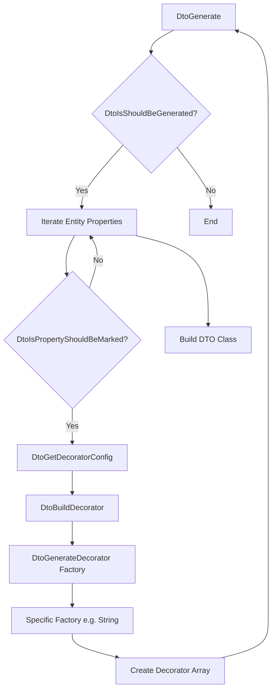
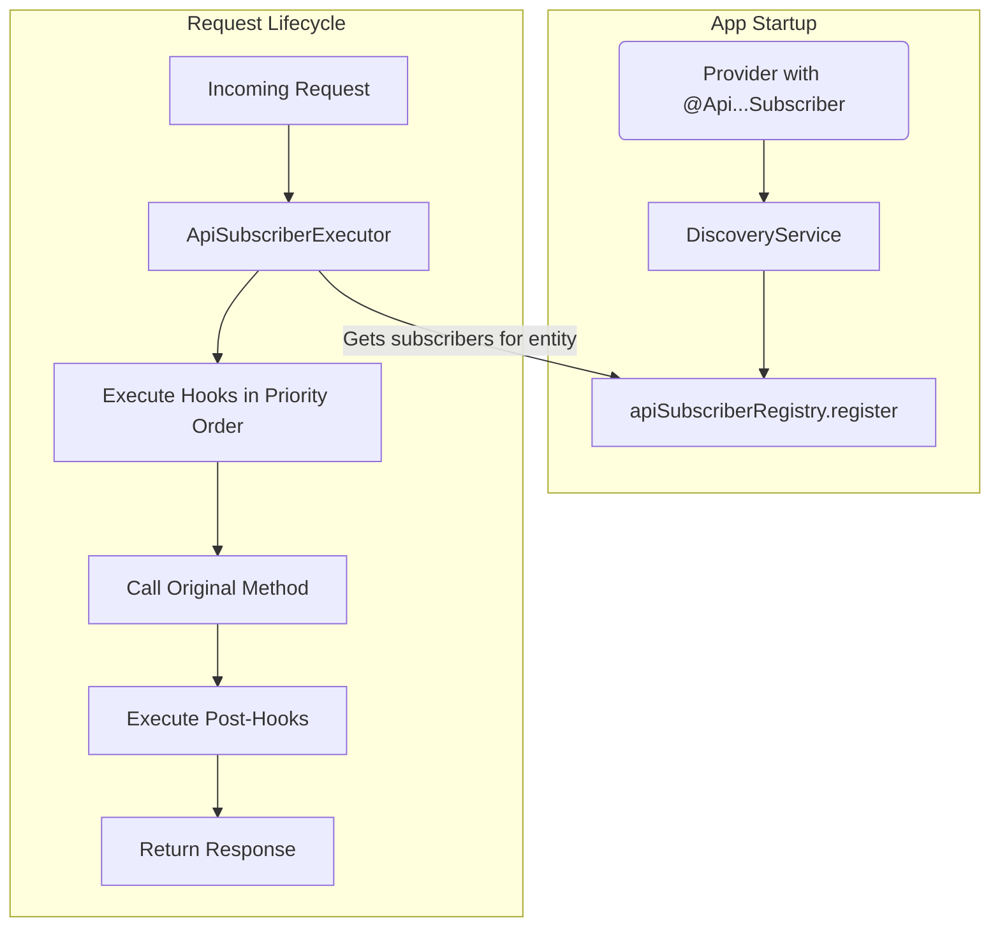

# NestJS CRUD Automator: Полное руководство

Этот документ представляет собой исчерпывающее руководство по библиотеке `nestjs-crud-automator`. Он охватывает все: от основных концепций до тонкостей архитектуры и продвинутых сценариев использования.

## Оглавление

1.  [Введение](#1-введение)
    *   [Какую проблему решает?](#какую-проблему-решает)
    *   [Философия дизайна](#философия-дизайна)
2.  [Ключевые концепции](#2-ключевые-концепции)
    *   [Генерация кода в реальном времени](#генерация-кода-в-реальном-времени)
    *   [Конфигурация через декораторы](#конфигурация-через-декораторы)
    *   [Соглашение вместо конфигурации](#соглашение-вместо-конфигурации)
    *   [Расширяемость и кастомизация](#расширяемость-и-кастомизация)
3.  [Полное руководство по началу работы](#3-полное-руководство-по-началу-работы)
    *   [Шаг 1: Установка](#шаг-1-установка)
    *   [Шаг 2: Определение сущностей](#шаг-2-определение-сущностей)
    *   [Шаг 3: Создание сервисов](#шаг-3-создание-сервисов)
    *   [Шаг 4: Создание контроллера](#шаг-4-создание-контроллера)
    *   [Шаг 5: Настройка модуля](#шаг-5-настройка-модуля)
    *   [Шаг 6: Запуск и тестирование](#шаг-6-запуск-и-тестирование)
4.  [Основные декораторы: Подробный обзор](#4-основные-декораторы-подробный-обзор)
    *   [`@ApiController`](#apicontroller-1)
    *   [`@ApiService`](#apiservice-1)
    *   [`@ApiFunction`](#apifunction-1)
    *   [`@ApiPropertyDescribe`](#apipropertydescribe-1)
5.  [Детальная конфигурация маршрутов](#5-детальная-конфигурация-маршрутов)
    *   [Структура конфигурации маршрута](#структура-конфигурации-маршрута)
    *   [Управление DTO (`dto` и `autoDto`)](#управление-dto-dto-и-autodto)
    *   [Аутентификация (`authentication`)](#аутентификация-authentication)
    *   [Обработка связей (`relations`)](#обработка-связей-relations)
    *   [Трансформация данных (`transformers`)](#трансформация-данных-transformers)
    *   [Пользовательская валидация (`validators`)](#пользовательская-валидация-validators)
6.  [Конфигурация свойств (`@ApiPropertyDescribe`)](#6-конфигурация-свойств-apipropertydescribe)
    *   [Дискриминационное объединение](#дискриминационное-объединение)
    *   [Общие свойства](#общие-свойства)
    *   [Конфигурация по типам](#конфигурация-по-типам)
    *   [Переопределение свойств (`properties`)](#переопределение-свойств-properties)
7.  [Продвинутые возможности](#7-продвинутые-возможности)
    *   [Динамическая генерация DTO](#динамическая-генерация-dto)
    *   [Полиморфные DTO (`oneOf`)](#полиморфные-dto-oneof)
    *   [Система подписчиков (Hooks)](#система-подписчиков-hooks)
8.  [Архитектурный обзор](#8-архитектурный-обзор)
    *   [Хранилище метаданных (`MetadataStorage`)](#хранилище-метаданных-metadatastorage)
    *   [Конвейер генерации DTO](#конвейер-генерации-dto)
    *   [Система подписчиков](#система-подписчиков)
    *   [Пользовательские валидаторы](#пользовательские-валидаторы)
9.  [Справочник по API](#9-справочник-по-api)
    *   [Перечисления (`Enums`)](#перечисления-enums)
    *   [Типы (`Types`)](#типы-types)

---

## 1. Введение

### Какую проблему решает?

В типичном NestJS-приложении создание полного набора CRUD-эндпоинтов для сущности включает в себя:
-   Создание контроллера с пятью или более методами (`create`, `getOne`, `getList`, `update`, `delete`).
-   Написание соответствующих методов в сервисе, которые взаимодействуют с базой данных.
-   Определение нескольких DTO (Data Transfer Objects) для валидации входящих данных (`CreateUserDto`, `UpdateUserDto`, `UserListQueryDto`) и сериализации ответов (`UserResponseDto`).
-   Добавление декораторов `@Body()`, `@Query()`, `@Param()` в методы контроллера.
-   Добавление декораторов `@Api...` от `@nestjs/swagger` для документации.

Этот процесс утомителен, подвержен ошибкам и приводит к большому количеству однотипного кода. `nestjs-crud-automator` решает эту проблему, беря на себя всю рутинную работу. Вы описываете *что* вы хотите получить, а не *как* это сделать.

### Философия дизайна

1.  **Декларативность**: Вы описываете желаемое состояние API с помощью декораторов. Логика генерации скрыта от вас.
2.  **Минимум кода**: Цель — сократить объем шаблонного кода до абсолютного минимума.
3.  **Гибкость**: Несмотря на автоматизацию, у вас остается полный контроль. Любую часть сгенерированного поведения можно переопределить или расширить.
4.  **Типобезопасность**: Максимальное использование возможностей TypeScript для предотвращения ошибок на этапе конфигурации.

## 2. Ключевые концепции

### Генерация кода в реальном времени

В отличие от инструментов, генерирующих файлы с кодом (schematics), эта библиотека генерирует классы и применяет декораторы в памяти во время запуска приложения. Когда NestJS инициализирует ваш декорированный контроллер, `nestjs-crud-automator` динамически создает методы, DTO, и привязывает к ним метаданные NestJS и Swagger.

### Конфигурация через декораторы

Вся конфигурация происходит через декораторы TypeScript. Это позволяет держать конфигурацию рядом с кодом, к которому она относится (например, правила валидации поля — рядом с определением поля в сущности).

### Соглашение вместо конфигурации

Библиотека использует разумные соглашения для уменьшения явной конфигурации:
-   **Именование сервисов связей**: Если у сущности `Book` есть связь `author: Author`, библиотека будет ожидать, что сервис для `Author` будет доступен в контроллере под ключом `authorService`.
-   **Префиксы методов**: Генерируемые методы имеют внутренний префикс `__NCD__` (например, `__NCD__create`), чтобы избежать конфликтов с вашими собственными методами в контроллере.
-   **Именование DTO**: Генерируемые DTO получают предсказуемые имена, например `UserCreateBodyDto`, `UserGetListQueryDto`.

### Расширяемость и кастомизация

Вы можете "вмешаться" в любой этап процесса:
-   **Заменить DTO**: Предоставить свой собственный класс DTO вместо сгенерированного.
-   **Дополнить DTO**: Добавить пользовательские валидаторы `class-validator` в сгенерированный DTO.
-   **Добавить валидацию**: Внедрить асинхронную логику валидации, которая выполняется перед основной логикой маршрута.
-   **Трансформировать данные**: Изменить входящие или исходящие данные.
-   **Использовать хуки (подписчики)**: Выполнить код до или после любой операции на уровне контроллера или сервиса.

## 3. Полное руководство по началу работы

Создадим API для блога с пользователями и постами.

### Шаг 1: Установка
```bash
npm install nestjs-crud-automator class-validator class-transformer @nestjs/swagger typeorm @nestjs/typeorm
```

### Шаг 2: Определение сущностей

Опишем сущности `User` и `Post` и их свойства с помощью `@ApiPropertyDescribe`.

`user.entity.ts`
```typescript
import { Entity, PrimaryGeneratedColumn, Column, OneToMany } from 'typeorm';
import { ApiPropertyDescribe, EApiPropertyDescribeType, EApiPropertyStringType } from 'nestjs-crud-automator';
import { Post } from '../post/post.entity';

@Entity()
export class User {
    @PrimaryGeneratedColumn('uuid')
    @ApiPropertyDescribe({ type: EApiPropertyDescribeType.UUID })
    id: string;

    @Column({ unique: true })
    @ApiPropertyDescribe({
        type: EApiPropertyDescribeType.STRING,
        format: EApiPropertyStringType.EMAIL,
        description: 'User email, must be unique.',
        properties: {
            create: { body: { isRequired: true } },
            update: { body: { isRequired: false } },
        }
    })
    email: string;

    @OneToMany(() => Post, post => post.author)
    @ApiPropertyDescribe({ type: EApiPropertyDescribeType.RELATION, description: 'User posts' })
    posts: Post[];
}
```

`post.entity.ts`
```typescript
import { Entity, PrimaryGeneratedColumn, Column, ManyToOne } from 'typeorm';
import { ApiPropertyDescribe, EApiPropertyDescribeType, EApiPropertyStringType } from 'nestjs-crud-automator';
import { User } from '../user/user.entity';

@Entity()
export class Post {
    @PrimaryGeneratedColumn('uuid')
    @ApiPropertyDescribe({ type: EApiPropertyDescribeType.UUID })
    id: string;

    @Column()
    @ApiPropertyDescribe({
        type: EApiPropertyDescribeType.STRING,
        format: EApiPropertyStringType.STRING,
        minLength: 5,
        properties: { create: { body: { isRequired: true } } }
    })
    title: string;

    @ManyToOne(() => User, user => user.posts)
    @ApiPropertyDescribe({ type: EApiPropertyDescribeType.RELATION })
    author: User;
}
```

### Шаг 3: Создание сервисов

Сервисы — это тонкие слои, которые наследуются от `ApiServiceBase` и предоставляют реализацию для `@ApiFunction`.

`user.service.ts`
```typescript
import { Injectable } from '@nestjs/common';
import { ApiService, ApiServiceBase, ApiFunction } from 'nestjs-crud-automator';
import { User } from './user.entity';
import { Repository } from 'typeorm';
import { InjectRepository } from '@nestjs/typeorm';

@Injectable()
@ApiService({ entity: User })
export class UserService extends ApiServiceBase<User> {
    constructor(@InjectRepository(User) public readonly repository: Repository<User>) {
        super();
    }

    @ApiFunction() public get;
    @ApiFunction() public getList;
    @ApiFunction() public create;
    @ApiFunction() public update;
    @ApiFunction() public delete;
}
```

`post.service.ts` (аналогично)
```typescript
// ... imports
@Injectable()
@ApiService({ entity: Post })
export class PostService extends ApiServiceBase<Post> {
    constructor(@InjectRepository(Post) public readonly repository: Repository<Post>) {
        super();
    }
    // ... @ApiFunction() declarations for get, getList, create, etc.
}
```

### Шаг 4: Создание контроллера

Создадим контроллер для постов. Мы хотим иметь возможность создавать посты, указывая `author` по его `id`.

`post.controller.ts`
```typescript
import { Controller } from '@nestjs/common';
import { ApiController, EApiControllerLoadRelationsStrategy } from 'nestjs-crud-automator';
import { PostService } from './post.service';
import { Post } from './post.entity';
import { UserService } from '../user/user.service';

@Controller('posts')
@ApiController({
    entity: Post,
    routes: {
        create: {
            // Включаем автоматическую обработку связей
            relations: {
                shouldLoadRelations: true,
                // Библиотека будет искать сервисы по соглашению (author -> authorService)
                servicesLoadStrategy: EApiControllerLoadRelationsStrategy.AUTO,
                // Все связи в DTO будут обработаны
                relationsLoadStrategy: EApiControllerLoadRelationsStrategy.AUTO,
            }
        },
        get: {},
        getList: {},
    },
})
export class PostController {
    // Важно: public service и public authorService
    constructor(
        public readonly service: PostService,
        public readonly authorService: UserService, // Сервис для связи 'author'
    ) {}
}
```

### Шаг 5: Настройка модуля

Собираем все вместе в модуле.

```typescript
import { Module } from '@nestjs/common';
import { TypeOrmModule } from '@nestjs/typeorm';
import { ApiSubscriberDiscoveryService } from 'nestjs-crud-automator';
import { User } from './user/user.entity';
import { Post } from './post/post.entity';
import { UserService } from './user/user.service';
import { PostService } from './post/post.service';
import { PostController } from './post/post.controller';
import { UserController } from './user/user.controller'; // Предполагаем, что он тоже создан

@Module({
    imports: [
        // ... TypeOrmModule.forRoot(...)
        TypeOrmModule.forFeature([User, Post])
    ],
    providers: [
        UserService,
        PostService,
        // Сервис для обнаружения подписчиков (если вы их используете)
        ApiSubscriberDiscoveryService,
    ],
    controllers: [PostController, UserController],
})
export class AppModule {}
```

### Шаг 6: Запуск и тестирование

Теперь вы можете запустить приложение. У вас будут рабочие эндпоинты `GET /posts`, `GET /posts/:id` и `POST /posts`.

Пример запроса на создание поста:
`POST /posts`
```json
{
    "title": "My First Post",
    "author": "a1b2c3d4-e5f6-..." // UUID пользователя
}
```
Библиотека автоматически проверит, существует ли пользователь с таким `id`, и если да, привяжет его к новому посту.

## 4. Основные декораторы: Подробный обзор

### `@ApiController`

Превращает обычный класс NestJS в автоматизированный CRUD-контроллер.

| Свойство | Тип                                    | Описание                                                                                                                  |
| :------- | :------------------------------------- | :------------------------------------------------------------------------------------------------------------------------ |
| `entity` | `new () => E`                          | **Обязательно.** Класс-конструктор сущности TypeORM, которой управляет контроллер.                                         |
| `routes` | `Record<EApiRouteType, RouteConfig<E>>` | **Обязательно.** Объект, где ключ - это тип маршрута (`create`, `getList` и т.д.), а значение - его конфигурация. |

### `@ApiService`

Связывает сервис с сущностью и включает его в механизм `nestjs-crud-automator`.

| Свойство | Тип           | Описание                                                       |
| :------- | :------------ | :------------------------------------------------------------- |
| `entity` | `new () => E` | **Обязательно.** Класс-конструктор сущности, с которой работает сервис. |

### `@ApiFunction`

Декоратор-маркер для методов внутри `@ApiService`. Сообщает библиотеке, что она должна предоставить реализацию для этого метода.

```typescript
@ApiFunction()
public getList; // Реализация будет предоставлена
```

### `@ApiPropertyDescribe`

Самый важный и подробный декоратор. Применяется к свойствам сущности и управляет их поведением в DTO, валидации и Swagger-документации. Его конфигурация подробно рассмотрена в [секции 6](#6-конфигурация-свойств-apipropertydescribe).

## 5. Детальная конфигурация маршрутов

### Структура конфигурации маршрута

Каждый ключ в объекте `routes` декоратора `@ApiController` принимает объект конфигурации.

```typescript
// TApiControllerPropertiesRoute<E, R>
{
    dto?: { /* ... */ },
    autoDto?: { /* ... */ },
    authentication?: { /* ... */ },
    relations?: { /* ... */ },
    transformers?: { /* ... */ },
    validators?: { /* ... */ }
}
```

### Управление DTO (`dto` и `autoDto`)

Вы можете либо предоставить свои собственные DTO, либо настроить их автоматическую генерацию.

-   **`dto`**: Используйте, если у вас есть готовые классы DTO.
    ```typescript
    dto: {
        query: GetPostsQueryDto,    // для GET /posts
        response: PostResponseDto,  // для ответа
    }
    ```
-   **`autoDto`**: Используйте для настройки генерации.
    ```typescript
    autoDto: {
        // Добавить кастомные class-validator'ы в сгенерированный DTO
        body: {
            validators: [{ constraintClass: CustomBodyValidator }]
        }
    }
    ```

### Аутентификация (`authentication`)

Привязывает гвард аутентификации к маршруту.

```typescript
authentication: {
    guard: JwtAuthGuard, // Экземпляр гварда
    // Опционально: тип аутентификации для документации
    type: EApiAuthenticationType.USER,
}
```

### Обработка связей (`relations`)

Включает и настраивает автоматическую загрузку связанных сущностей по их ID.

| Свойство                            | Тип                                   | Описание                                                                                                                |
| :---------------------------------- | :------------------------------------ | :---------------------------------------------------------------------------------------------------------------------- |
| `shouldLoadRelations`               | `boolean`                             | Включает или выключает эту функцию.                                                                                      |
| `relationsLoadStrategy`             | `EApiControllerLoadRelationsStrategy` | `AUTO`: обрабатывать все связи. `MANUAL`: обрабатывать только те, что указаны в `relationsToLoad`.                          |
| `relationsToLoad`                   | `Array<keyof E>`                      | **Обязательно для `MANUAL`**. Список связей для обработки.                                                                  |
| `servicesLoadStrategy`              | `EApiControllerLoadRelationsStrategy` | `AUTO`: искать сервисы по соглашению (`author` -> `authorService`). `MANUAL`: использовать маппинг из `relationsServices`. |
| `relationsServices`                 | `Record<keyof E, string>`             | **Обязательно для `MANUAL`**. Объект, где ключ - имя связи, а значение - ключ сервиса в контроллере.                       |
| `shouldForceAllServicesToBeSpecified`| `boolean`                             | В режиме `AUTO`, если `true`, выдаст ошибку, если сервис для связи не найден. По умолчанию `false`.                           |


### Трансформация данных (`transformers`)

Позволяет изменять объекты `request`, `query`, `body` или `response`.

-   `type`: `STATIC` или `DYNAMIC`.
-   `key`: Имя свойства, которое нужно добавить или изменить.
-   `value`: Значение (для `STATIC`) или константа из `TRANSFORMER_VALUE_DTO_CONSTANT` (для `DYNAMIC`).
-   `shouldSetValueEvenIfMissing`: Если `true`, добавит свойство, даже если его не было в объекте.

Пример: Добавить IP-адрес клиента в тело запроса при создании.
```typescript
transformers: {
    body: [{
        type: EApiControllerRequestTransformerType.DYNAMIC,
        key: 'creatorIp',
        value: TRANSFORMER_VALUE_DTO_CONSTANT.REQUEST_IP,
        shouldSetValueEvenIfMissing: true,
    }]
}
```

### Пользовательская валидация (`validators`)

Добавляет асинхронные функции валидации.

```typescript
validators: [{
    // Функция, возвращающая true или false. Может быть асинхронной.
    validationFunction: async (body, // or query, or params
    ) => {
        // ...
        return true;
    },
    // Исключение, которое будет выброшено при false.
    exception: ConflictException,
    // Ключ для генерации сообщения об ошибке.
    errorType: EErrorStringAction.ALREADY_EXISTS,
}]
```

## 6. Конфигурация свойств (`@ApiPropertyDescribe`)

### Дискриминационное объединение

Конфигурация `@ApiPropertyDescribe` — это [дискриминационное объединение](https://www.typescriptlang.org/docs/handbook/2/narrowing.html#discriminated-unions). Свойство `type` (`EApiPropertyDescribeType`) действует как дискриминант, определяя, какие другие свойства доступны в объекте.

### Общие свойства

Эти свойства доступны для **всех** типов `EApiPropertyDescribeType`.

| Свойство         | Тип                                                   | Описание                                                                                                                                                                                                         |
| :--------------- | :---------------------------------------------------- | :--------------------------------------------------------------------------------------------------------------------------------------------------------------------------------------------------------------- |
| `type`           | `EApiPropertyDescribeType`                            | **Дискриминант.** Определяет основной тип свойства (`STRING`, `NUMBER`, `OBJECT` и т.д.).                                                                                                                         |
| `description`    | `string`                                              | Описание для Swagger-документации.                                                                                                                                                                               |
| `isNullable`     | `boolean`                                             | Если `true`, помечает свойство как `nullable` в Swagger. По умолчанию `false`.                                                                                                                                   |
| `isArray`        | `boolean`                                             | Если `true`, помечает свойство как массив. Позволяет использовать `minItems`, `maxItems`.                                                                                                                         |
| `example`        | `any`                                                 | Пример значения для Swagger.                                                                                                                                                                                     |
| `properties`     | `TApiPropertyDescribePropertiesBaseProperties`        | Позволяет переопределить поведение свойства для конкретных маршрутов и типов DTO. См. [ниже](#переопределение-свойств-properties). |

### Конфигурация по типам

В зависимости от `type`, становятся доступны дополнительные свойства.

-   **`type: EApiPropertyDescribeType.STRING`**
    -   `format`: `EApiPropertyStringType` (`EMAIL`, `URL`, `UUID` и т.д.) - определяет и формат Swagger, и декоратор `class-validator` (`@IsEmail()`, `@IsUrl()`).
    -   `minLength`, `maxLength`, `pattern`: Стандартные правила валидации строк.
-   **`type: EApiPropertyDescribeType.NUMBER`**
    -   `format`: `EApiPropertyNumberType` (`INTEGER`, `DOUBLE`).
    -   `minimum`, `maximum`, `multipleOf`: Стандартные правила валидации чисел.
-   **`type: EApiPropertyDescribeType.DATE`**
    -   `format`: `EApiPropertyDateType` (`DATE`, `DATE_TIME`, `TIME`).
    -   `identifier`: `EApiPropertyDateIdentifier` - Семантический идентификатор (`CREATED_AT`, `UPDATED_AT`), который позволяет библиотеке автоматически создавать поля для фильтрации по диапазону (`createdAtFrom`, `createdAtTo`).
-   **`type: EApiPropertyDescribeType.OBJECT`**
    -   `dataType`: Либо класс DTO для вложенного объекта, либо конфигурация для полиморфного объекта (`oneOf`).
    -   `discriminator`: Конфигурация дискриминатора для `oneOf`.

### Переопределение свойств (`properties`)

Это мощнейший механизм, позволяющий одному `@ApiPropertyDescribe` определять разное поведение для одного и того же поля в разных контекстах.

```typescript
@ApiPropertyDescribe({
    type: EApiPropertyDescribeType.STRING,
    // ...
    properties: {
        // Контекст: маршрут create (POST /)
        [EApiRouteType.CREATE]: {
            // Контекст: тело запроса
            [EApiDtoType.BODY]: {
                // Поле обязательно при создании
                isRequired: true,
                // Но скрыто в ответе
                isExpose: false,
            }
        },
        // Контекст: маршрут update (PUT/PATCH /:id)
        [EApiRouteType.UPDATE]: {
            [EApiDtoType.BODY]: {
                // Поле необязательно при обновлении
                isRequired: false,
            }
        },
        // Контекст: маршрут getList (GET /)
        [EApiRouteType.GET_LIST]: {
            [EApiDtoType.QUERY]: {
                // Разрешить сортировку по этому полю
                useAsOrderByFilter: true,
            }
        }
    }
})
```

## 7. Продвинутые возможности

### Динамическая генерация DTO

Для каждого маршрута библиотека генерирует до 4-х классов DTO: `Request` (для параметров пути, например, `:id`), `Query` (для `GET` запросов), `Body` и `Response`.

-   **`GET_LIST` Query DTO**: Самый сложный. Кроме пагинации (`limit`, `page`) и сортировки (`orderBy`, `orderDirection`), он включает поля для фильтрации для каждого свойства, помеченного в `@ApiPropertyDescribe`. Фильтрация имеет формат:
    -   `имяПоля[value]=значение`
    -   `имяПоля[values]=значение1,значение2`
    -   `имяПоля[operator]=eq` (оператор из `EFilterOperation`)

### Полиморфные DTO (`oneOf`)

Вы можете определять свойства, которые могут принимать одну из нескольких форм, используя `discriminator`.

```typescript
@ApiPropertyDescribe({
    type: EApiPropertyDescribeType.OBJECT,
    // ...
    dataType: [NotificationEmailDto, NotificationSmsDto],
    discriminator: {
        propertyName: 'type', // Поле, по которому определяется тип
        mapping: {
            'email': NotificationEmailDto,
            'sms': NotificationSmsDto,
        }
    }
})
notification: NotificationEmailDto | NotificationSmsDto;
```
Библиотека автоматически применит валидатор `MustMatchOneOfSchemasValidator` и сгенерирует корректную `oneOf` схему для Swagger.

### Система подписчиков (Hooks)

Это реализация паттерна "Наблюдатель" для встраивания в жизненный цикл запроса.

-   **`ApiRouteSubscriberBase`**: Перехватывает события на уровне контроллера. Имеет доступ к HTTP-контексту.
-   **`ApiFunctionSubscriberBase`**: Перехватывает события на уровне сервиса. Идеально для логики, близкой к БД.

**Порядок выполнения:**
1.  `onBefore...` хуки Route-подписчиков (по приоритету).
2.  Логика контроллера (трансформация, валидация).
3.  Вызов метода сервиса.
4.  `onBefore...` хуки Function-подписчиков (по приоритету).
5.  Логика сервиса (`@ApiFunction`).
6.  `onAfter...` хуки Function-подписчиков (в обратном порядке приоритета).
7.  Возврат результата в контроллер.
8.  `onAfter...` хуки Route-подписчиков (в обратном порядке приоритета).
9.  Отправка ответа клиенту.

## 8. Архитектурный обзор

### Хранилище метаданных (`MetadataStorage`)

Это глобальный синглтон, который служит центральным реестром для всей информации, собранной из декораторов `@ApiPropertyDescribe`. Это позволяет отделить фазу сбора информации (когда NestJS сканирует классы) от фазы ее использования (когда генерируются DTO и контроллеры).

### Конвейер генерации DTO


### Система подписчиков


### Пользовательские валидаторы

Библиотека поставляется с набором мощных, многоразовых валидаторов `class-validator`.
-   `HasPairedCustomSuffixesFieldsValidator`: Сердце механизма фильтрации. Он использует регулярное выражение для разбора полей вида `name[suffix]`, группирует их по `name` и затем для каждой группы проверяет логику:
    1.  Если есть `value`/`values`, должен быть и `operator`.
    2.  Если есть `operator`, должен быть хотя бы один `value`/`values` (кроме операторов типа `isnull`).
    3.  Проверяет, что тип значения (массив или одиночное) соответствует требованиям оператора (например, `in` требует массив, `eq` - одиночное значение).
-   `MustMatchOneOfSchemasValidator`: Валидирует полиморфные объекты. Проверяет наличие поля-дискриминатора и соответствие его значения одному из ключей в `mapping`.

## 9. Справочник по API
*(Этот раздел можно расширить, детально описав каждый enum и сложный тип)*

### Перечисления (`Enums`)
-   `EApiRouteType`: Типы маршрутов (`CREATE`, `GET_LIST`, ...).
-   `EApiDtoType`: Типы DTO (`BODY`, `QUERY`, ...).
-   `EApiPropertyDescribeType`: Основные типы свойств (`STRING`, `NUMBER`, ...).
-   `EFilterOperation`: Все возможные операторы для фильтрации (`EQ`, `GT`, `CONT`, ...).
-   ... и многие другие.

### Типы (`Types`)
-   `TApiControllerPropertiesRoute`: Конфигурация одного маршрута.
-   `TApiPropertyDescribeProperties`: Конфигурация одного свойства.
-   ... и другие.
